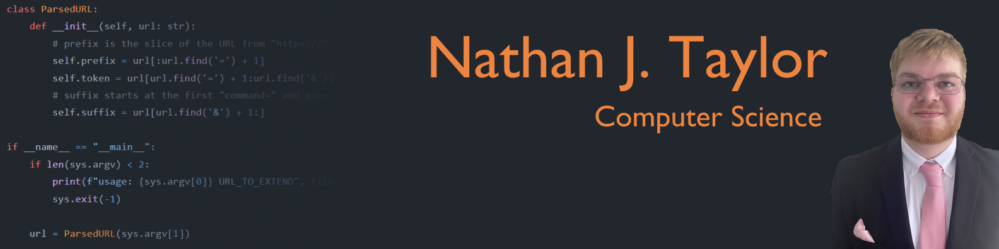

 
 ### Hi there 👋
#### I'm **Nate** (he/him), i'm studying Computer Science at the University of Michigan -- Ann Arbor.
#### My main interests include Video Game Development, Computer Security, IT work, and Artificial Intelligence.

### Clubs/Activities:
  

### Notable Classes At The University Of Michigan
🟡 EECS 201 -- Computer Science Pragmatics, ✔️ EECS 203 -- Discrete Mathematics, ✔️ EECS 280 -- Programming and Introductory Data Structures, ✔️ EECS 281 -- Data Structures and Algorithms, ✔️ EDUC 333 -- Video Games & Learning, ✔️ EECS 370 -- Introduction to Computer Organization, 🟡 EECS 376 -- Foundations of Computer Science, ✔️ EECS 388 -- Introduction to Computer Security, 🟡 EECS 442 -- Computer Vision, 🟡 EECS 445 -- Intro to Machine Learning, ✔️ EECS 494 -- Computer Game Design and Development

✔️ = Completed, 🟡 = In Progress
